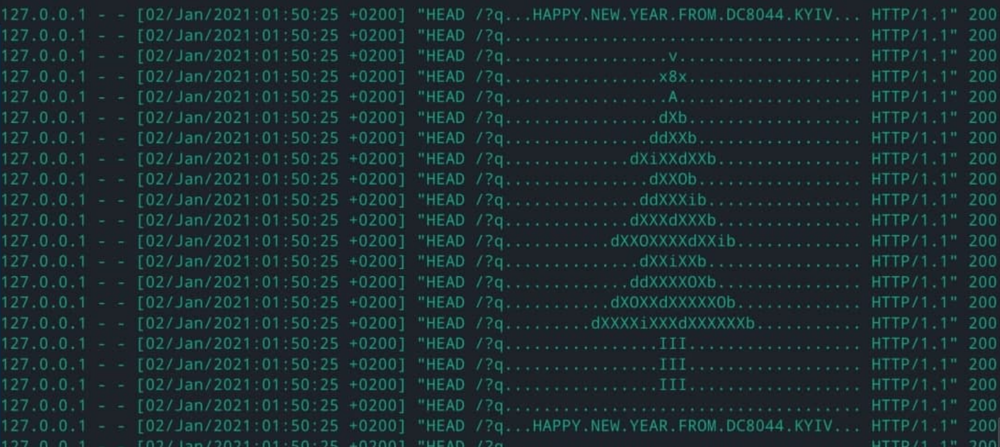

# logcrap

Utility for spamming http logs with ASCII art of x-mass trees.



Original idea belongs to someone associated with 33c3. I don't know who, but it
was very pleasant to receive "request of http congrats" with 2018(?) year in 
my ./netcat <3

I improved this idea a bit while brainstorming with DC8044 KYIV community.

Usage
----
Firstly, you should to scan 80 port with something like `masscan` or `zmap`.
This is **not** scanner. I advise finding trial VPS or free 
RuVDS( with voice call confirmation). I don't know how hosters react for 
these "jokes".

**Disclaimer:** There are no things like unit tests, so debug yourself.  And, 
do not play with unicode and other non-url shit.

Install dependencies:
```bash
pipenv install
````

Run:
```bash
python3 send.py <ips-file> <ascii-art> <workers> 
```

For ex.:
```bash
python3 send.py ips.txt art.txt 1000
```

If there are more workers than 1000, linux system may be tuned with `ulimit`,
because connection spends opened files limit (file descriptor).

Windows systems should be reinstalled to linux, lol.


How it works?
---
This script utilizes thing named "keep-alive connections". In one tcp 
connection, can be sent dozens of http requests asynchronously.
Nginx and apache httpd web servers were not seen in chewing logs order, but 
I don't know for others.
